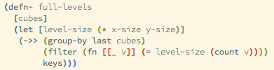

# Solarized Parentheses

A [solarized](http://ethanschoonover.com/solarized) theme for [Light Table](http://www.lighttable.com) designed to work together with parentheses to make code readable.  Currently only includes light variant.

A font that includes both bolder and lighter variants (such as [Source Code Pro](https://github.com/adobe/source-code-pro)) makes the parentheses properly stand out.
